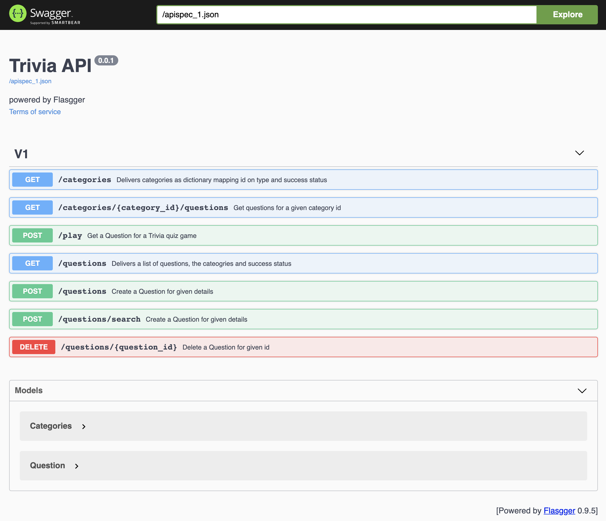

# Trivia API instructions:

## Requirements:
* Python 3.8 Follow instructions to install the latest version of python for your platform in the [python docs](https://docs.python.org/3/using/unix.html#getting-and-installing-the-latest-version-of-python)

## Getting started - Code, Virtualenv and PIP dependencies

We recommend working within a virtual environment whenever using Python for projects. This keeps your dependencies for each project separate and organaized. Instructions for setting up a virual enviornment for your platform can be found in the [python docs](https://packaging.python.org/guides/installing-using-pip-and-virtual-environments/)
You can review all required dependenices in the requirements.txt.

> git clone git@github.com:genughaben/trivia_api.git
> python3 -m venv venv
> pip install -r requirements.txt

## Setup database

### Make sure no other service uses port 5432

You can check that typing:

> sudo lsof -i:5432

You can either stop possibly running process or kill it using:

> kill <process_id>

### Setup production and testing database:

Type:

> ./start-databases.sh

## Run API app:

To execute the API app in DEBUG mode, run:

> FLASK_APP=flaskr/__init__.py FLASK_ENV=development flask run

NB: Setting the `FLASK_ENV` variable to `development` will detect file changes and restart the server automatically.

To execute the API app in production mode, run:

> FLASK_APP=flaskr/__init__.py flask run

## Testing

### Automatic Testing:

To execute all tests run:

> pytest

If you want to run individual tests, go into the tests folder and look for INSPECTION section in the test comments.
There are commands to execute individual tests. Adapt those to your liking, if applicable.

### Manual Testing

To inspect the endpoints when of an running app, you can use the import and use the postman collection provided in the file:

backend/trivia.postman_collection.json

## Coverage

To create a coverage report, run:
The required configuration can be found in setup.cfg.

> coverage run -m pytest
> coverage html

To view the created report, go to foldeR: htmlcov and open index.html in your favorite browser.

## Debugging / Logging

For debugging, a log file can be visited to see full error messages and stack trace.
trivia.log.

You can also add more log statements by importing the logger from flaskr/logger.py add write to it using:
* logger.info for info
* logger.debug for debug info
* logger.info error for error info

To read more, look here: https://docs.python.org/3/howto/logging.html

## Endpoints:

The documentation of the endpoints has been done using Swagger.
To view the documentation run the app:

> FLASK_APP=flaskr/__init__.py FLASK_ENV=development flask run

and visit [http://localhost:5000/apidocs/](http://localhost:5000/apidocs/)

You should see something like:

